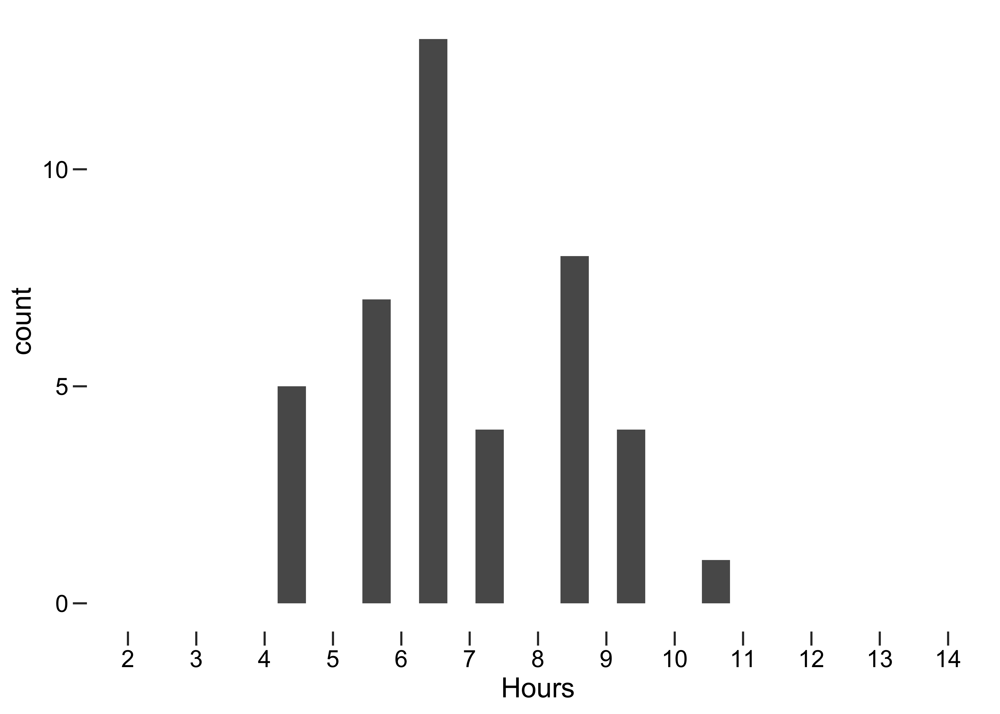
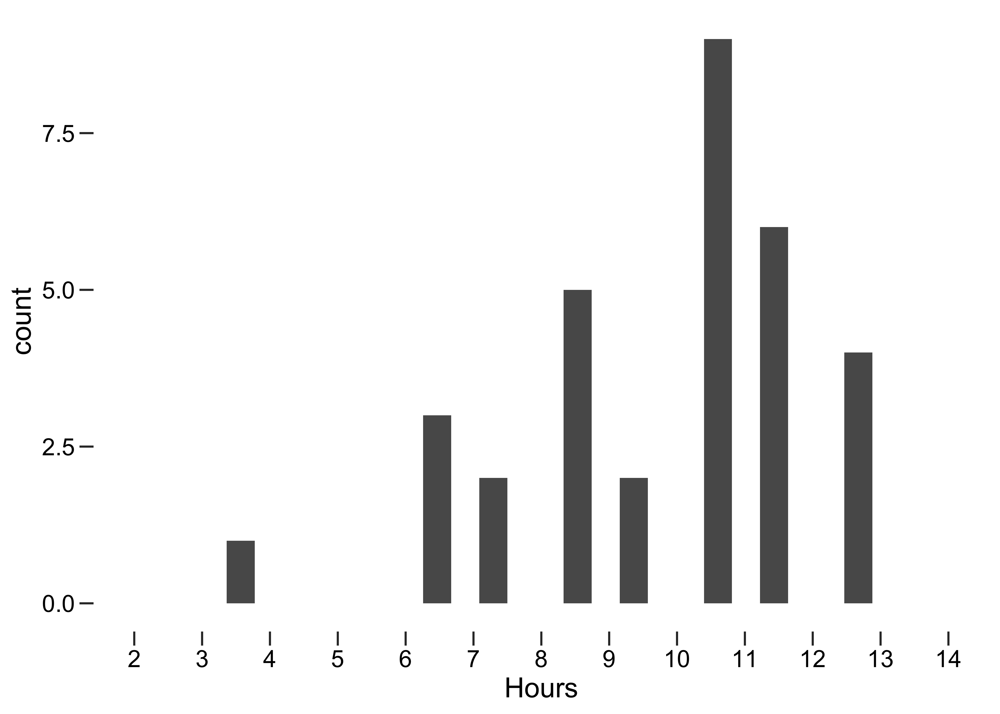
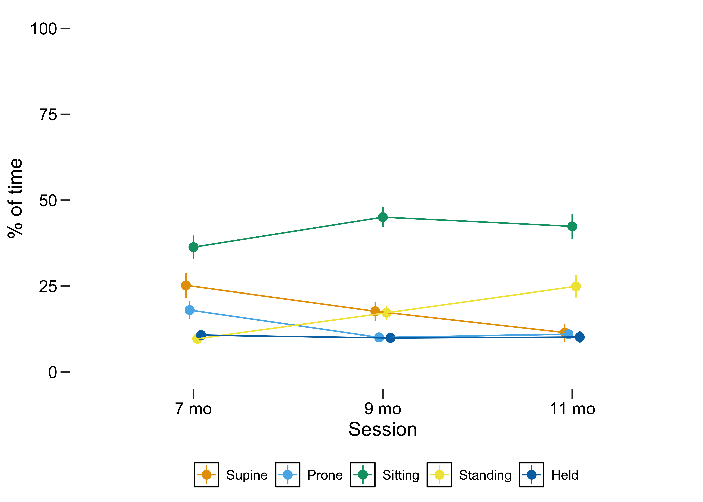
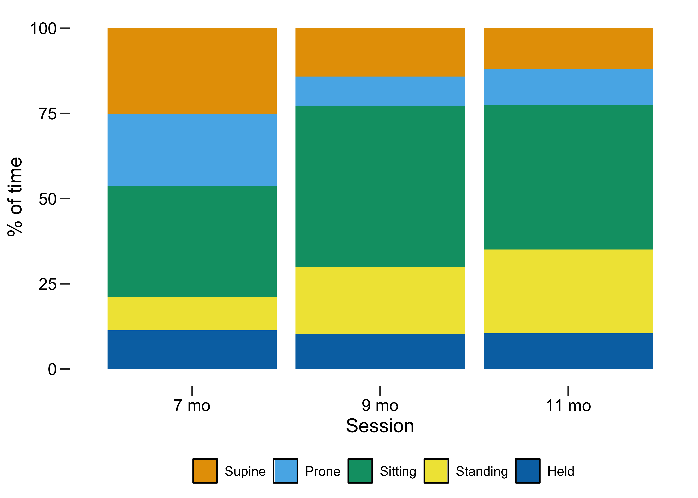
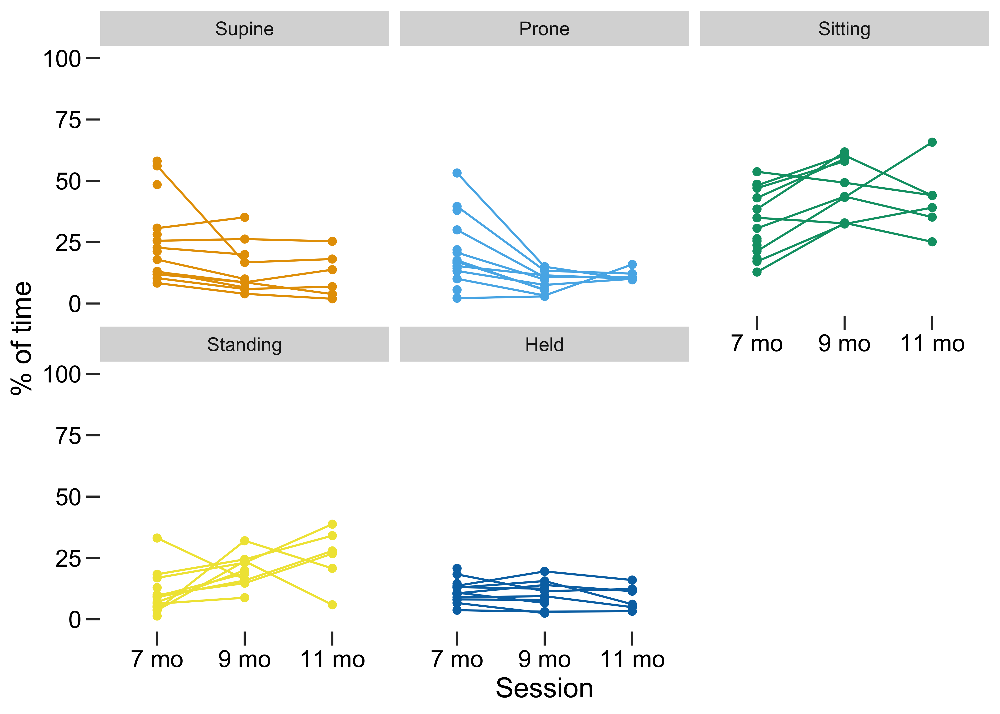

::: {.cell}

:::


| Last updated: 2026-03-02 14:00:43 using pinned data version from: 2026-02-27 15:14:26
| Users can load data by running (requires one-time google drive authentication):


::: {.cell}

```{.r .cell-code}
library(tidyverse)
library(pins)
library(nanoparquet)
library(googledrive)
ds <- board_gdrive(path = as_id("1OZlphhu6vYm1A2Bm2-zD7a4luS5nGWgS")) %>%
  pin_read("imu_raw_samples")
```
:::


### Usable data


::: {.cell tbl-cap='Usable data and total recording length in hours'}

```{.r .cell-code}
usable_data <- ds %>% count(id, session) %>% mutate(usable_hours = n/3600)
recording_duration <- ds %>% group_by(id, session) %>% 
  mutate(recording_hours = as.numeric(time_leg_off - time_leg_on)) %>% 
  slice_head(n = 1) %>% ungroup
  
usable_data %>% left_join(recording_duration) %>% 
  get_summary_stats(usable_hours, recording_hours, show = c("mean", "sd","min","max")) %>% 
  flextable() %>% autofit()
```

::: {.cell-output-display}

```{=html}
<div class="tabwid"><style>.cl-4391b3ae{}.cl-436b1e74{font-family:'Helvetica';font-size:11pt;font-weight:normal;font-style:normal;text-decoration:none;color:rgba(0, 0, 0, 1.00);background-color:transparent;}.cl-4378f300{margin:0;text-align:left;border-bottom: 0 solid rgba(0, 0, 0, 1.00);border-top: 0 solid rgba(0, 0, 0, 1.00);border-left: 0 solid rgba(0, 0, 0, 1.00);border-right: 0 solid rgba(0, 0, 0, 1.00);padding-bottom:5pt;padding-top:5pt;padding-left:5pt;padding-right:5pt;line-height: 1;background-color:transparent;}.cl-4378f314{margin:0;text-align:right;border-bottom: 0 solid rgba(0, 0, 0, 1.00);border-top: 0 solid rgba(0, 0, 0, 1.00);border-left: 0 solid rgba(0, 0, 0, 1.00);border-right: 0 solid rgba(0, 0, 0, 1.00);padding-bottom:5pt;padding-top:5pt;padding-left:5pt;padding-right:5pt;line-height: 1;background-color:transparent;}.cl-437af9ac{width:1.389in;background-color:transparent;vertical-align: middle;border-bottom: 1.5pt solid rgba(102, 102, 102, 1.00);border-top: 1.5pt solid rgba(102, 102, 102, 1.00);border-left: 0 solid rgba(0, 0, 0, 1.00);border-right: 0 solid rgba(0, 0, 0, 1.00);margin-bottom:0;margin-top:0;margin-left:0;margin-right:0;}.cl-437af9b6{width:0.455in;background-color:transparent;vertical-align: middle;border-bottom: 1.5pt solid rgba(102, 102, 102, 1.00);border-top: 1.5pt solid rgba(102, 102, 102, 1.00);border-left: 0 solid rgba(0, 0, 0, 1.00);border-right: 0 solid rgba(0, 0, 0, 1.00);margin-bottom:0;margin-top:0;margin-left:0;margin-right:0;}.cl-437af9b7{width:0.752in;background-color:transparent;vertical-align: middle;border-bottom: 1.5pt solid rgba(102, 102, 102, 1.00);border-top: 1.5pt solid rgba(102, 102, 102, 1.00);border-left: 0 solid rgba(0, 0, 0, 1.00);border-right: 0 solid rgba(0, 0, 0, 1.00);margin-bottom:0;margin-top:0;margin-left:0;margin-right:0;}.cl-437af9c0{width:0.668in;background-color:transparent;vertical-align: middle;border-bottom: 1.5pt solid rgba(102, 102, 102, 1.00);border-top: 1.5pt solid rgba(102, 102, 102, 1.00);border-left: 0 solid rgba(0, 0, 0, 1.00);border-right: 0 solid rgba(0, 0, 0, 1.00);margin-bottom:0;margin-top:0;margin-left:0;margin-right:0;}.cl-437af9c1{width:1.389in;background-color:transparent;vertical-align: middle;border-bottom: 0 solid rgba(0, 0, 0, 1.00);border-top: 0 solid rgba(0, 0, 0, 1.00);border-left: 0 solid rgba(0, 0, 0, 1.00);border-right: 0 solid rgba(0, 0, 0, 1.00);margin-bottom:0;margin-top:0;margin-left:0;margin-right:0;}.cl-437af9ca{width:0.455in;background-color:transparent;vertical-align: middle;border-bottom: 0 solid rgba(0, 0, 0, 1.00);border-top: 0 solid rgba(0, 0, 0, 1.00);border-left: 0 solid rgba(0, 0, 0, 1.00);border-right: 0 solid rgba(0, 0, 0, 1.00);margin-bottom:0;margin-top:0;margin-left:0;margin-right:0;}.cl-437af9d4{width:0.752in;background-color:transparent;vertical-align: middle;border-bottom: 0 solid rgba(0, 0, 0, 1.00);border-top: 0 solid rgba(0, 0, 0, 1.00);border-left: 0 solid rgba(0, 0, 0, 1.00);border-right: 0 solid rgba(0, 0, 0, 1.00);margin-bottom:0;margin-top:0;margin-left:0;margin-right:0;}.cl-437af9d5{width:0.668in;background-color:transparent;vertical-align: middle;border-bottom: 0 solid rgba(0, 0, 0, 1.00);border-top: 0 solid rgba(0, 0, 0, 1.00);border-left: 0 solid rgba(0, 0, 0, 1.00);border-right: 0 solid rgba(0, 0, 0, 1.00);margin-bottom:0;margin-top:0;margin-left:0;margin-right:0;}.cl-437af9de{width:1.389in;background-color:transparent;vertical-align: middle;border-bottom: 1.5pt solid rgba(102, 102, 102, 1.00);border-top: 0 solid rgba(0, 0, 0, 1.00);border-left: 0 solid rgba(0, 0, 0, 1.00);border-right: 0 solid rgba(0, 0, 0, 1.00);margin-bottom:0;margin-top:0;margin-left:0;margin-right:0;}.cl-437af9df{width:0.455in;background-color:transparent;vertical-align: middle;border-bottom: 1.5pt solid rgba(102, 102, 102, 1.00);border-top: 0 solid rgba(0, 0, 0, 1.00);border-left: 0 solid rgba(0, 0, 0, 1.00);border-right: 0 solid rgba(0, 0, 0, 1.00);margin-bottom:0;margin-top:0;margin-left:0;margin-right:0;}.cl-437af9e8{width:0.752in;background-color:transparent;vertical-align: middle;border-bottom: 1.5pt solid rgba(102, 102, 102, 1.00);border-top: 0 solid rgba(0, 0, 0, 1.00);border-left: 0 solid rgba(0, 0, 0, 1.00);border-right: 0 solid rgba(0, 0, 0, 1.00);margin-bottom:0;margin-top:0;margin-left:0;margin-right:0;}.cl-437af9e9{width:0.668in;background-color:transparent;vertical-align: middle;border-bottom: 1.5pt solid rgba(102, 102, 102, 1.00);border-top: 0 solid rgba(0, 0, 0, 1.00);border-left: 0 solid rgba(0, 0, 0, 1.00);border-right: 0 solid rgba(0, 0, 0, 1.00);margin-bottom:0;margin-top:0;margin-left:0;margin-right:0;}</style><table data-quarto-disable-processing='true' class='cl-4391b3ae'><thead><tr style="overflow-wrap:break-word;"><th class="cl-437af9ac"><p class="cl-4378f300"><span class="cl-436b1e74">variable</span></p></th><th class="cl-437af9b6"><p class="cl-4378f314"><span class="cl-436b1e74">n</span></p></th><th class="cl-437af9b7"><p class="cl-4378f314"><span class="cl-436b1e74">mean</span></p></th><th class="cl-437af9c0"><p class="cl-4378f314"><span class="cl-436b1e74">sd</span></p></th><th class="cl-437af9c0"><p class="cl-4378f314"><span class="cl-436b1e74">min</span></p></th><th class="cl-437af9b7"><p class="cl-4378f314"><span class="cl-436b1e74">max</span></p></th></tr></thead><tbody><tr style="overflow-wrap:break-word;"><td class="cl-437af9c1"><p class="cl-4378f300"><span class="cl-436b1e74">usable_hours</span></p></td><td class="cl-437af9ca"><p class="cl-4378f314"><span class="cl-436b1e74">11</span></p></td><td class="cl-437af9d4"><p class="cl-4378f314"><span class="cl-436b1e74">6.310</span></p></td><td class="cl-437af9d5"><p class="cl-4378f314"><span class="cl-436b1e74">1.449</span></p></td><td class="cl-437af9d5"><p class="cl-4378f314"><span class="cl-436b1e74">4.432</span></p></td><td class="cl-437af9d4"><p class="cl-4378f314"><span class="cl-436b1e74">9.466</span></p></td></tr><tr style="overflow-wrap:break-word;"><td class="cl-437af9de"><p class="cl-4378f300"><span class="cl-436b1e74">recording_hours</span></p></td><td class="cl-437af9df"><p class="cl-4378f314"><span class="cl-436b1e74">11</span></p></td><td class="cl-437af9e8"><p class="cl-4378f314"><span class="cl-436b1e74">10.085</span></p></td><td class="cl-437af9e9"><p class="cl-4378f314"><span class="cl-436b1e74">1.388</span></p></td><td class="cl-437af9e9"><p class="cl-4378f314"><span class="cl-436b1e74">7.533</span></p></td><td class="cl-437af9e8"><p class="cl-4378f314"><span class="cl-436b1e74">12.317</span></p></td></tr></tbody></table></div>
```

:::
:::

::: {.cell layout-ncol="2"}

```{.r .cell-code}
usable_data  %>% 
  ggplot(aes(x = usable_hours)) + 
  geom_histogram() + 
  scale_x_binned(name = "Hours", limits = c(2,14))
```

::: {.cell-output-display}
{width=100%}
:::

```{.r .cell-code}
recording_duration  %>% 
  ggplot(aes(x = recording_hours)) + 
  geom_histogram() + 
  scale_x_binned(name = "Hours", limits = c(2,14))
```

::: {.cell-output-display}
{width=100%}
:::
:::


### Infant Position Frequency by Age (Overall)


::: {.cell tbl-cap='Position summary statistics'}

```{.r .cell-code}
ds_sum <- ds %>% group_by(id, session) %>% 
  mutate(total_samples = n()) %>% group_by(id, session, pos) %>% 
  summarize(pos_n  = n(), total_samples = mean(total_samples)) %>% ungroup
ds_sum <- ds_sum %>% complete(nesting(id, session), pos, fill = list(pos_n = 0, total_samples = 1))
ds_sum$pos_prop = ds_sum$pos_n/ds_sum$total_samples*100
ds_sum$session = as.numeric(ds_sum$session)

ds_sum %>% group_by(pos, session) %>% 
  get_summary_stats(pos_prop, show = c("mean", "sd","min","max")) %>% 
  select(-variable) %>% flextable() %>% autofit()
```

::: {.cell-output-display}

```{=html}
<div class="tabwid"><style>.cl-48f19c4c{}.cl-48ccd48e{font-family:'Helvetica';font-size:11pt;font-weight:normal;font-style:normal;text-decoration:none;color:rgba(0, 0, 0, 1.00);background-color:transparent;}.cl-48dba0d6{margin:0;text-align:right;border-bottom: 0 solid rgba(0, 0, 0, 1.00);border-top: 0 solid rgba(0, 0, 0, 1.00);border-left: 0 solid rgba(0, 0, 0, 1.00);border-right: 0 solid rgba(0, 0, 0, 1.00);padding-bottom:5pt;padding-top:5pt;padding-left:5pt;padding-right:5pt;line-height: 1;background-color:transparent;}.cl-48dba0ea{margin:0;text-align:left;border-bottom: 0 solid rgba(0, 0, 0, 1.00);border-top: 0 solid rgba(0, 0, 0, 1.00);border-left: 0 solid rgba(0, 0, 0, 1.00);border-right: 0 solid rgba(0, 0, 0, 1.00);padding-bottom:5pt;padding-top:5pt;padding-left:5pt;padding-right:5pt;line-height: 1;background-color:transparent;}.cl-48dbb508{width:0.803in;background-color:transparent;vertical-align: middle;border-bottom: 1.5pt solid rgba(102, 102, 102, 1.00);border-top: 1.5pt solid rgba(102, 102, 102, 1.00);border-left: 0 solid rgba(0, 0, 0, 1.00);border-right: 0 solid rgba(0, 0, 0, 1.00);margin-bottom:0;margin-top:0;margin-left:0;margin-right:0;}.cl-48dbb512{width:0.888in;background-color:transparent;vertical-align: middle;border-bottom: 1.5pt solid rgba(102, 102, 102, 1.00);border-top: 1.5pt solid rgba(102, 102, 102, 1.00);border-left: 0 solid rgba(0, 0, 0, 1.00);border-right: 0 solid rgba(0, 0, 0, 1.00);margin-bottom:0;margin-top:0;margin-left:0;margin-right:0;}.cl-48dbb51c{width:0.37in;background-color:transparent;vertical-align: middle;border-bottom: 1.5pt solid rgba(102, 102, 102, 1.00);border-top: 1.5pt solid rgba(102, 102, 102, 1.00);border-left: 0 solid rgba(0, 0, 0, 1.00);border-right: 0 solid rgba(0, 0, 0, 1.00);margin-bottom:0;margin-top:0;margin-left:0;margin-right:0;}.cl-48dbb51d{width:0.752in;background-color:transparent;vertical-align: middle;border-bottom: 1.5pt solid rgba(102, 102, 102, 1.00);border-top: 1.5pt solid rgba(102, 102, 102, 1.00);border-left: 0 solid rgba(0, 0, 0, 1.00);border-right: 0 solid rgba(0, 0, 0, 1.00);margin-bottom:0;margin-top:0;margin-left:0;margin-right:0;}.cl-48dbb526{width:0.803in;background-color:transparent;vertical-align: middle;border-bottom: 0 solid rgba(0, 0, 0, 1.00);border-top: 0 solid rgba(0, 0, 0, 1.00);border-left: 0 solid rgba(0, 0, 0, 1.00);border-right: 0 solid rgba(0, 0, 0, 1.00);margin-bottom:0;margin-top:0;margin-left:0;margin-right:0;}.cl-48dbb527{width:0.888in;background-color:transparent;vertical-align: middle;border-bottom: 0 solid rgba(0, 0, 0, 1.00);border-top: 0 solid rgba(0, 0, 0, 1.00);border-left: 0 solid rgba(0, 0, 0, 1.00);border-right: 0 solid rgba(0, 0, 0, 1.00);margin-bottom:0;margin-top:0;margin-left:0;margin-right:0;}.cl-48dbb530{width:0.37in;background-color:transparent;vertical-align: middle;border-bottom: 0 solid rgba(0, 0, 0, 1.00);border-top: 0 solid rgba(0, 0, 0, 1.00);border-left: 0 solid rgba(0, 0, 0, 1.00);border-right: 0 solid rgba(0, 0, 0, 1.00);margin-bottom:0;margin-top:0;margin-left:0;margin-right:0;}.cl-48dbb531{width:0.752in;background-color:transparent;vertical-align: middle;border-bottom: 0 solid rgba(0, 0, 0, 1.00);border-top: 0 solid rgba(0, 0, 0, 1.00);border-left: 0 solid rgba(0, 0, 0, 1.00);border-right: 0 solid rgba(0, 0, 0, 1.00);margin-bottom:0;margin-top:0;margin-left:0;margin-right:0;}.cl-48dbb53a{width:0.803in;background-color:transparent;vertical-align: middle;border-bottom: 0 solid rgba(0, 0, 0, 1.00);border-top: 0 solid rgba(0, 0, 0, 1.00);border-left: 0 solid rgba(0, 0, 0, 1.00);border-right: 0 solid rgba(0, 0, 0, 1.00);margin-bottom:0;margin-top:0;margin-left:0;margin-right:0;}.cl-48dbb53b{width:0.888in;background-color:transparent;vertical-align: middle;border-bottom: 0 solid rgba(0, 0, 0, 1.00);border-top: 0 solid rgba(0, 0, 0, 1.00);border-left: 0 solid rgba(0, 0, 0, 1.00);border-right: 0 solid rgba(0, 0, 0, 1.00);margin-bottom:0;margin-top:0;margin-left:0;margin-right:0;}.cl-48dbb544{width:0.37in;background-color:transparent;vertical-align: middle;border-bottom: 0 solid rgba(0, 0, 0, 1.00);border-top: 0 solid rgba(0, 0, 0, 1.00);border-left: 0 solid rgba(0, 0, 0, 1.00);border-right: 0 solid rgba(0, 0, 0, 1.00);margin-bottom:0;margin-top:0;margin-left:0;margin-right:0;}.cl-48dbb545{width:0.752in;background-color:transparent;vertical-align: middle;border-bottom: 0 solid rgba(0, 0, 0, 1.00);border-top: 0 solid rgba(0, 0, 0, 1.00);border-left: 0 solid rgba(0, 0, 0, 1.00);border-right: 0 solid rgba(0, 0, 0, 1.00);margin-bottom:0;margin-top:0;margin-left:0;margin-right:0;}.cl-48dbb546{width:0.803in;background-color:transparent;vertical-align: middle;border-bottom: 0 solid rgba(0, 0, 0, 1.00);border-top: 0 solid rgba(0, 0, 0, 1.00);border-left: 0 solid rgba(0, 0, 0, 1.00);border-right: 0 solid rgba(0, 0, 0, 1.00);margin-bottom:0;margin-top:0;margin-left:0;margin-right:0;}.cl-48dbb54e{width:0.888in;background-color:transparent;vertical-align: middle;border-bottom: 0 solid rgba(0, 0, 0, 1.00);border-top: 0 solid rgba(0, 0, 0, 1.00);border-left: 0 solid rgba(0, 0, 0, 1.00);border-right: 0 solid rgba(0, 0, 0, 1.00);margin-bottom:0;margin-top:0;margin-left:0;margin-right:0;}.cl-48dbb54f{width:0.37in;background-color:transparent;vertical-align: middle;border-bottom: 0 solid rgba(0, 0, 0, 1.00);border-top: 0 solid rgba(0, 0, 0, 1.00);border-left: 0 solid rgba(0, 0, 0, 1.00);border-right: 0 solid rgba(0, 0, 0, 1.00);margin-bottom:0;margin-top:0;margin-left:0;margin-right:0;}.cl-48dbb550{width:0.752in;background-color:transparent;vertical-align: middle;border-bottom: 0 solid rgba(0, 0, 0, 1.00);border-top: 0 solid rgba(0, 0, 0, 1.00);border-left: 0 solid rgba(0, 0, 0, 1.00);border-right: 0 solid rgba(0, 0, 0, 1.00);margin-bottom:0;margin-top:0;margin-left:0;margin-right:0;}.cl-48dbb558{width:0.803in;background-color:transparent;vertical-align: middle;border-bottom: 0 solid rgba(0, 0, 0, 1.00);border-top: 0 solid rgba(0, 0, 0, 1.00);border-left: 0 solid rgba(0, 0, 0, 1.00);border-right: 0 solid rgba(0, 0, 0, 1.00);margin-bottom:0;margin-top:0;margin-left:0;margin-right:0;}.cl-48dbb559{width:0.888in;background-color:transparent;vertical-align: middle;border-bottom: 0 solid rgba(0, 0, 0, 1.00);border-top: 0 solid rgba(0, 0, 0, 1.00);border-left: 0 solid rgba(0, 0, 0, 1.00);border-right: 0 solid rgba(0, 0, 0, 1.00);margin-bottom:0;margin-top:0;margin-left:0;margin-right:0;}.cl-48dbb562{width:0.37in;background-color:transparent;vertical-align: middle;border-bottom: 0 solid rgba(0, 0, 0, 1.00);border-top: 0 solid rgba(0, 0, 0, 1.00);border-left: 0 solid rgba(0, 0, 0, 1.00);border-right: 0 solid rgba(0, 0, 0, 1.00);margin-bottom:0;margin-top:0;margin-left:0;margin-right:0;}.cl-48dbb563{width:0.752in;background-color:transparent;vertical-align: middle;border-bottom: 0 solid rgba(0, 0, 0, 1.00);border-top: 0 solid rgba(0, 0, 0, 1.00);border-left: 0 solid rgba(0, 0, 0, 1.00);border-right: 0 solid rgba(0, 0, 0, 1.00);margin-bottom:0;margin-top:0;margin-left:0;margin-right:0;}.cl-48dbb56c{width:0.803in;background-color:transparent;vertical-align: middle;border-bottom: 1.5pt solid rgba(102, 102, 102, 1.00);border-top: 0 solid rgba(0, 0, 0, 1.00);border-left: 0 solid rgba(0, 0, 0, 1.00);border-right: 0 solid rgba(0, 0, 0, 1.00);margin-bottom:0;margin-top:0;margin-left:0;margin-right:0;}.cl-48dbb56d{width:0.888in;background-color:transparent;vertical-align: middle;border-bottom: 1.5pt solid rgba(102, 102, 102, 1.00);border-top: 0 solid rgba(0, 0, 0, 1.00);border-left: 0 solid rgba(0, 0, 0, 1.00);border-right: 0 solid rgba(0, 0, 0, 1.00);margin-bottom:0;margin-top:0;margin-left:0;margin-right:0;}.cl-48dbb576{width:0.37in;background-color:transparent;vertical-align: middle;border-bottom: 1.5pt solid rgba(102, 102, 102, 1.00);border-top: 0 solid rgba(0, 0, 0, 1.00);border-left: 0 solid rgba(0, 0, 0, 1.00);border-right: 0 solid rgba(0, 0, 0, 1.00);margin-bottom:0;margin-top:0;margin-left:0;margin-right:0;}.cl-48dbb577{width:0.752in;background-color:transparent;vertical-align: middle;border-bottom: 1.5pt solid rgba(102, 102, 102, 1.00);border-top: 0 solid rgba(0, 0, 0, 1.00);border-left: 0 solid rgba(0, 0, 0, 1.00);border-right: 0 solid rgba(0, 0, 0, 1.00);margin-bottom:0;margin-top:0;margin-left:0;margin-right:0;}</style><table data-quarto-disable-processing='true' class='cl-48f19c4c'><thead><tr style="overflow-wrap:break-word;"><th class="cl-48dbb508"><p class="cl-48dba0d6"><span class="cl-48ccd48e">session</span></p></th><th class="cl-48dbb512"><p class="cl-48dba0ea"><span class="cl-48ccd48e">pos</span></p></th><th class="cl-48dbb51c"><p class="cl-48dba0d6"><span class="cl-48ccd48e">n</span></p></th><th class="cl-48dbb51d"><p class="cl-48dba0d6"><span class="cl-48ccd48e">mean</span></p></th><th class="cl-48dbb51d"><p class="cl-48dba0d6"><span class="cl-48ccd48e">sd</span></p></th><th class="cl-48dbb51d"><p class="cl-48dba0d6"><span class="cl-48ccd48e">min</span></p></th><th class="cl-48dbb51d"><p class="cl-48dba0d6"><span class="cl-48ccd48e">max</span></p></th></tr></thead><tbody><tr style="overflow-wrap:break-word;"><td class="cl-48dbb526"><p class="cl-48dba0d6"><span class="cl-48ccd48e">1</span></p></td><td class="cl-48dbb527"><p class="cl-48dba0ea"><span class="cl-48ccd48e">Supine</span></p></td><td class="cl-48dbb530"><p class="cl-48dba0d6"><span class="cl-48ccd48e">8</span></p></td><td class="cl-48dbb531"><p class="cl-48dba0d6"><span class="cl-48ccd48e">22.316</span></p></td><td class="cl-48dbb531"><p class="cl-48dba0d6"><span class="cl-48ccd48e">15.847</span></p></td><td class="cl-48dbb531"><p class="cl-48dba0d6"><span class="cl-48ccd48e">8.322</span></p></td><td class="cl-48dbb531"><p class="cl-48dba0d6"><span class="cl-48ccd48e">56.079</span></p></td></tr><tr style="overflow-wrap:break-word;"><td class="cl-48dbb526"><p class="cl-48dba0d6"><span class="cl-48ccd48e">2</span></p></td><td class="cl-48dbb527"><p class="cl-48dba0ea"><span class="cl-48ccd48e">Supine</span></p></td><td class="cl-48dbb530"><p class="cl-48dba0d6"><span class="cl-48ccd48e">3</span></p></td><td class="cl-48dbb531"><p class="cl-48dba0d6"><span class="cl-48ccd48e">9.787</span></p></td><td class="cl-48dbb531"><p class="cl-48dba0d6"><span class="cl-48ccd48e">6.476</span></p></td><td class="cl-48dbb531"><p class="cl-48dba0d6"><span class="cl-48ccd48e">3.956</span></p></td><td class="cl-48dbb531"><p class="cl-48dba0d6"><span class="cl-48ccd48e">16.756</span></p></td></tr><tr style="overflow-wrap:break-word;"><td class="cl-48dbb53a"><p class="cl-48dba0d6"><span class="cl-48ccd48e">1</span></p></td><td class="cl-48dbb53b"><p class="cl-48dba0ea"><span class="cl-48ccd48e">Prone</span></p></td><td class="cl-48dbb544"><p class="cl-48dba0d6"><span class="cl-48ccd48e">8</span></p></td><td class="cl-48dbb545"><p class="cl-48dba0d6"><span class="cl-48ccd48e">24.894</span></p></td><td class="cl-48dbb545"><p class="cl-48dba0d6"><span class="cl-48ccd48e">14.974</span></p></td><td class="cl-48dbb545"><p class="cl-48dba0d6"><span class="cl-48ccd48e">10.077</span></p></td><td class="cl-48dbb545"><p class="cl-48dba0d6"><span class="cl-48ccd48e">53.195</span></p></td></tr><tr style="overflow-wrap:break-word;"><td class="cl-48dbb53a"><p class="cl-48dba0d6"><span class="cl-48ccd48e">2</span></p></td><td class="cl-48dbb53b"><p class="cl-48dba0ea"><span class="cl-48ccd48e">Prone</span></p></td><td class="cl-48dbb544"><p class="cl-48dba0d6"><span class="cl-48ccd48e">3</span></p></td><td class="cl-48dbb545"><p class="cl-48dba0d6"><span class="cl-48ccd48e">8.489</span></p></td><td class="cl-48dbb545"><p class="cl-48dba0d6"><span class="cl-48ccd48e">4.547</span></p></td><td class="cl-48dbb545"><p class="cl-48dba0d6"><span class="cl-48ccd48e">3.257</span></p></td><td class="cl-48dbb545"><p class="cl-48dba0d6"><span class="cl-48ccd48e">11.490</span></p></td></tr><tr style="overflow-wrap:break-word;"><td class="cl-48dbb546"><p class="cl-48dba0d6"><span class="cl-48ccd48e">1</span></p></td><td class="cl-48dbb54e"><p class="cl-48dba0ea"><span class="cl-48ccd48e">Sitting</span></p></td><td class="cl-48dbb54f"><p class="cl-48dba0d6"><span class="cl-48ccd48e">8</span></p></td><td class="cl-48dbb550"><p class="cl-48dba0d6"><span class="cl-48ccd48e">32.721</span></p></td><td class="cl-48dbb550"><p class="cl-48dba0d6"><span class="cl-48ccd48e">14.944</span></p></td><td class="cl-48dbb550"><p class="cl-48dba0d6"><span class="cl-48ccd48e">12.819</span></p></td><td class="cl-48dbb550"><p class="cl-48dba0d6"><span class="cl-48ccd48e">53.703</span></p></td></tr><tr style="overflow-wrap:break-word;"><td class="cl-48dbb546"><p class="cl-48dba0d6"><span class="cl-48ccd48e">2</span></p></td><td class="cl-48dbb54e"><p class="cl-48dba0ea"><span class="cl-48ccd48e">Sitting</span></p></td><td class="cl-48dbb54f"><p class="cl-48dba0d6"><span class="cl-48ccd48e">3</span></p></td><td class="cl-48dbb550"><p class="cl-48dba0d6"><span class="cl-48ccd48e">41.752</span></p></td><td class="cl-48dbb550"><p class="cl-48dba0d6"><span class="cl-48ccd48e">8.576</span></p></td><td class="cl-48dbb550"><p class="cl-48dba0d6"><span class="cl-48ccd48e">32.400</span></p></td><td class="cl-48dbb550"><p class="cl-48dba0d6"><span class="cl-48ccd48e">49.249</span></p></td></tr><tr style="overflow-wrap:break-word;"><td class="cl-48dbb546"><p class="cl-48dba0d6"><span class="cl-48ccd48e">1</span></p></td><td class="cl-48dbb54e"><p class="cl-48dba0ea"><span class="cl-48ccd48e">Standing</span></p></td><td class="cl-48dbb54f"><p class="cl-48dba0d6"><span class="cl-48ccd48e">8</span></p></td><td class="cl-48dbb550"><p class="cl-48dba0d6"><span class="cl-48ccd48e">9.379</span></p></td><td class="cl-48dbb550"><p class="cl-48dba0d6"><span class="cl-48ccd48e">5.542</span></p></td><td class="cl-48dbb550"><p class="cl-48dba0d6"><span class="cl-48ccd48e">3.644</span></p></td><td class="cl-48dbb550"><p class="cl-48dba0d6"><span class="cl-48ccd48e">18.330</span></p></td></tr><tr style="overflow-wrap:break-word;"><td class="cl-48dbb546"><p class="cl-48dba0d6"><span class="cl-48ccd48e">2</span></p></td><td class="cl-48dbb54e"><p class="cl-48dba0ea"><span class="cl-48ccd48e">Standing</span></p></td><td class="cl-48dbb54f"><p class="cl-48dba0d6"><span class="cl-48ccd48e">3</span></p></td><td class="cl-48dbb550"><p class="cl-48dba0d6"><span class="cl-48ccd48e">23.616</span></p></td><td class="cl-48dbb550"><p class="cl-48dba0d6"><span class="cl-48ccd48e">8.113</span></p></td><td class="cl-48dbb550"><p class="cl-48dba0d6"><span class="cl-48ccd48e">15.798</span></p></td><td class="cl-48dbb550"><p class="cl-48dba0d6"><span class="cl-48ccd48e">31.995</span></p></td></tr><tr style="overflow-wrap:break-word;"><td class="cl-48dbb558"><p class="cl-48dba0d6"><span class="cl-48ccd48e">1</span></p></td><td class="cl-48dbb559"><p class="cl-48dba0ea"><span class="cl-48ccd48e">Held</span></p></td><td class="cl-48dbb562"><p class="cl-48dba0d6"><span class="cl-48ccd48e">8</span></p></td><td class="cl-48dbb563"><p class="cl-48dba0d6"><span class="cl-48ccd48e">10.690</span></p></td><td class="cl-48dbb563"><p class="cl-48dba0d6"><span class="cl-48ccd48e">4.465</span></p></td><td class="cl-48dbb563"><p class="cl-48dba0d6"><span class="cl-48ccd48e">3.704</span></p></td><td class="cl-48dbb563"><p class="cl-48dba0d6"><span class="cl-48ccd48e">18.293</span></p></td></tr><tr style="overflow-wrap:break-word;"><td class="cl-48dbb56c"><p class="cl-48dba0d6"><span class="cl-48ccd48e">2</span></p></td><td class="cl-48dbb56d"><p class="cl-48dba0ea"><span class="cl-48ccd48e">Held</span></p></td><td class="cl-48dbb576"><p class="cl-48dba0d6"><span class="cl-48ccd48e">3</span></p></td><td class="cl-48dbb577"><p class="cl-48dba0d6"><span class="cl-48ccd48e">16.356</span></p></td><td class="cl-48dbb577"><p class="cl-48dba0d6"><span class="cl-48ccd48e">2.847</span></p></td><td class="cl-48dbb577"><p class="cl-48dba0d6"><span class="cl-48ccd48e">13.970</span></p></td><td class="cl-48dbb577"><p class="cl-48dba0d6"><span class="cl-48ccd48e">19.508</span></p></td></tr></tbody></table></div>
```

:::
:::

::: {.cell layout-ncol="2"}

```{.r .cell-code}
ggplot(ds_sum, aes(x = session, y = pos_prop, color = pos)) + 
  stat_summary(position = position_dodge(.1)) + 
  stat_summary(geom = "line", position = position_dodge(.1)) + 
  ylim(0,100) + ylab("% of time") + xlab("Session") +
  scale_x_continuous(breaks = 1:3, labels = c("7 mo","9 mo","11 mo"), limits = c(0.5,3.5)) + 
  scale_color_manual(values = pal, name ="") + 
  theme(legend.position = "bottom")
```

::: {.cell-output-display}
{width=100%}
:::

```{.r .cell-code}
ggplot(ds_sum, aes(x = session, y = pos_prop, fill = pos)) + 
  stat_summary(geom = "bar", position = "stack") + 
  ylim(0,100) + ylab("% of time") + xlab("Session") +
  scale_x_continuous(breaks = 1:3, labels = c("7 mo","9 mo","11 mo"), limits = c(0.5,3.5)) + 
  scale_fill_manual(values = pal, name ="") + 
  theme(legend.position = "bottom")
```

::: {.cell-output-display}
{width=100%}
:::
:::


### Infant Position Frequency by Age (Individual)


::: {.cell}

```{.r .cell-code}
ggplot(ds_sum, aes(x = session, y = pos_prop, color = pos, group = id)) + 
  facet_wrap(~ pos) + 
  geom_point() + geom_line() +  
  ylim(0,100) + ylab("% of time") + xlab("Session") +
  scale_x_continuous(breaks = 1:3, labels = c("7 mo","9 mo","11 mo"), limits = c(0.5,3.5)) + 
  scale_color_manual(values = pal, name ="") + 
  theme(legend.position = "none")
```

::: {.cell-output-display}
{width=90%}
:::
:::

